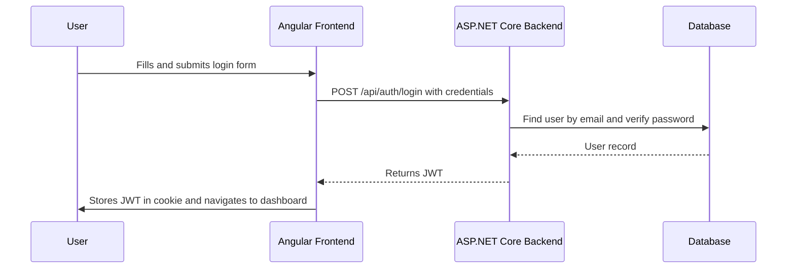
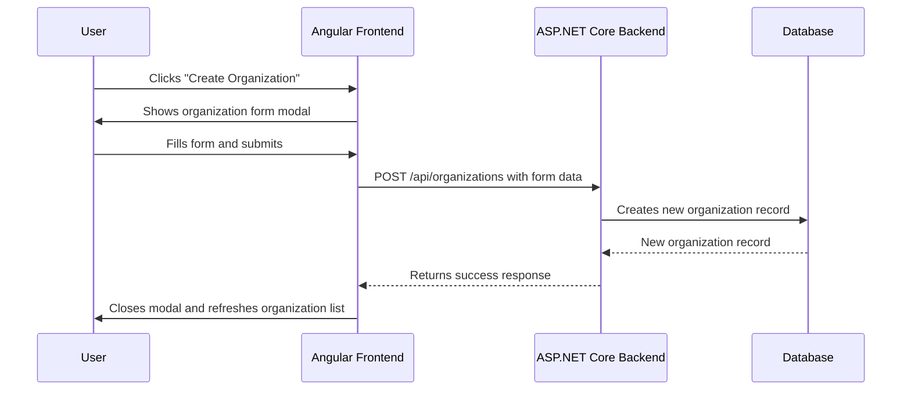
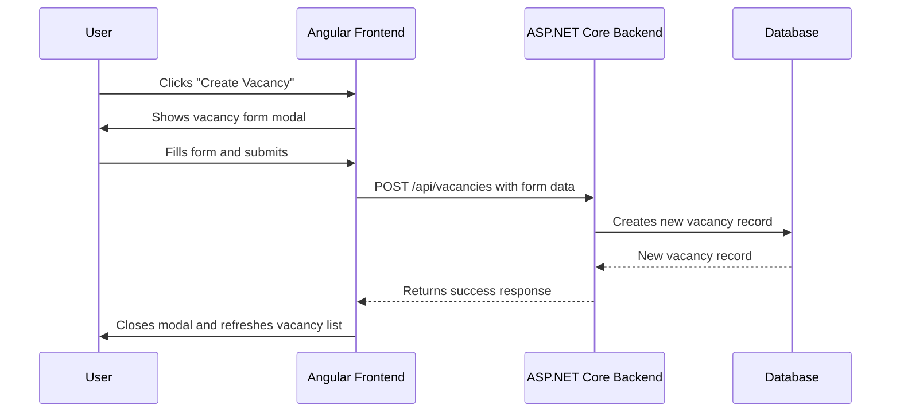
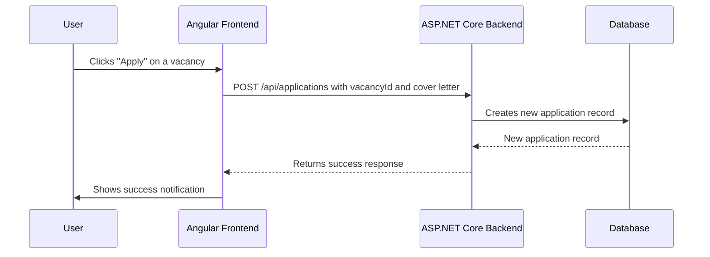
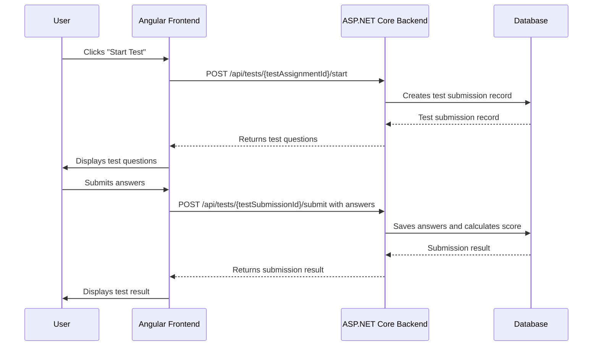

# Data Flow Diagrams

## Authentication Flow

```mermaid
sequenceDiagram
    participant User
    participant Angular as Angular Frontend
    participant Backend as ASP.NET Core Backend
    participant Database

    User->>Angular: Fills and submits login form
    Angular->>Backend: POST /api/auth/login with credentials
    Backend->>Database: Find user by email and verify password
    Database-->>Backend: User record
    Backend-->>Angular: Returns JWT
    Angular->>User: Stores JWT in cookie and navigates to dashboard
```

## Organization CRUD Flow

```mermaid
sequenceDiagram
    participant User
    participant Angular as Angular Frontend
    participant Backend as ASP.NET Core Backend
    participant Database

    User->>Angular: Clicks "Create Organization"
    Angular->>User: Shows organization form modal
    User->>Angular: Fills form and submits
    Angular->>Backend: POST /api/organizations with form data
    Backend->>Database: Creates new organization record
    Database-->>Backend: New organization record
    Backend-->>Angular: Returns success response
    Angular->>User: Closes modal and refreshes organization list
```

## Vacancy CRUD Flow

```mermaid
sequenceDiagram
    participant User
    participant Angular as Angular Frontend
    participant Backend as ASP.NET Core Backend
    participant Database

    User->>Angular: Clicks "Create Vacancy"
    Angular->>User: Shows vacancy form modal
    User->>Angular: Fills form and submits
    Angular->>Backend: POST /api/vacancies with form data
    Backend->>Database: Creates new vacancy record
    Database-->>Backend: New vacancy record
    Backend-->>Angular: Returns success response
    Angular->>User: Closes modal and refreshes vacancy list
```

## Application Flow

```mermaid
sequenceDiagram
    participant User
    participant Angular as Angular Frontend
    participant Backend as ASP.NET Core Backend
    participant Database

    User->>Angular: Clicks "Apply" on a vacancy
    Angular->>Backend: POST /api/applications with vacancyId and cover letter
    Backend->>Database: Creates new application record
    Database-->>Backend: New application record
    Backend-->>Angular: Returns success response
    Angular->>User: Shows success notification
```

## Test Flow

```mermaid
sequenceDiagram
    participant User
    participant Angular as Angular Frontend
    participant Backend as ASP.NET Core Backend
    participant Database

    User->>Angular: Clicks "Start Test"
    Angular->>Backend: POST /api/tests/{testAssignmentId}/start
    Backend->>Database: Creates test submission record
    Database-->>Backend: Test submission record
    Backend-->>Angular: Returns test questions
    Angular->>User: Displays test questions
    User->>Angular: Submits answers
    Angular->>Backend: POST /api/tests/{testSubmissionId}/submit with answers
    Backend->>Database: Saves answers and calculates score
    Database-->>Backend: Submission result
    Backend-->>Angular: Returns submission result
    Angular->>User: Displays test result
```
